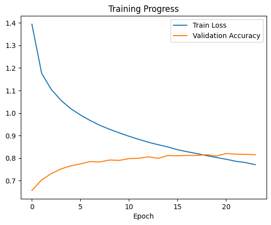

# PyTorch Transformer for code complexity classification


[](https://arxiv.org/abs/2503.15242)

<details>
  <summary><strong>Table of Contents</strong></summary>
  <ol>
    <li><a href="#introduction">Introduction</a></li>
    <li><a href="#project-overview">Project Overview</a></li>
    <li><a href="#configuration--hyperparameters-️">Configuration & Hyperparameters</a></li>
    <li><a href="#dataset">Dataset</a></li>
    <li><a href="#prerequisites">Prerequisites</a></li>
    <li><a href="#installation">Installation</a></li>
    <li><a href="#usage">Usage</a></li>
    <li><a href="#outputs">Outputs</a>
        <ul>
            <li><a href="#training-performance">Training Performance</a></li>
            <li><a href="#citation">Citation</a></li>
        </ul>
    </li>
  </ol>
</details>

## Introduction
This repository was born from the Natural Language Processing (NLP) course project, part of the Computer Science Engineering master's degree at Politecnico di Milano.
The notebooks of interest are grouped in the `notebooks/` directory:
- `Creating_Dataset.ipynb`: the initial pre-processing of the dataset taken from [**Hugging Face**](https://huggingface.co/).
- `CustomTransformer.ipynb`: designing, training and evaluation of the main Transformer Model.
- `Fine-TuningCodeComplex.ipynb`: Improve Main Transformer Model by Fine-Tuning using a **cleaner** dataset: [**Code Complex**](https://arxiv.org/abs/2401.08719).
- `TestingCodeComplex.ipynb`: Load different NLP models (Linear classifier, LSTM, custom Transformer and fine-tuned LLM [**CodeBERT**](https://arxiv.org/abs/2002.08155)) and evaluate their performance on the codeComplex dataset.

The main parts of the `CustomTransformer.ipynb` notebook have been cleaned up to provide an extensible and modular version of this project.


## Project Overview

This project implements a Transformer-based neural network to classify the time complexity of Python code solutions. 
The model analyzes the structure and semantics of a given code snippet and predicts its Big O notation (e.g., O(n), O(log n), etc.).

In particular, the model classifies within 7 classes:
- O(1)
- O(logn)
- O(n)
- O(n^2)
- O(n*m)
- O(n+m)
- O(n*logn)

The workflow is as follows:
1.  Python code snippets are tokenized using a pre-trained `microsoft/codebert-base` tokenizer, which has been augmented with custom tags to identify code structure.
2.  The model, built with a **Transformer Encoder architecture**, processes the token sequences to learn a representation of the code.
3.  A final classification layer predicts the corresponding time complexity class.

## Configuration & Hyperparameters ⚙️
The main hyperparameters and configuration settings used for training are centralized in the `config.py` file. 
The key parameters for the final model are listed below.

| Parameter             | Value                     | Description                               |
| --------------------- | ------------------------- | ----------------------------------------- |
| **Model Architecture**|                           |                                           |
| `D_MODEL`             | 256                       | The embedding dimension for the model.    |
| `N_HEAD`              | 8                         | Number of heads in the Multi-Head Attention. |
| `NUM_LAYERS`          | 4                         | Number of Transformer Encoder layers.     |
| `DROPOUT`             | 0.4                       | Dropout rate for regularization.          |
| **Training** |                           |                                           |
| `NUM_EPOCHS`          | 30                        | Maximum number of training epochs.        |
| `BATCH_SIZE`          | 64                        | Number of samples per batch.              |
| `LEARNING_RATE`       | 1e-4                      | Initial learning rate for the Adam optimizer. |
| **Data & Tokenizer** |                           |                                           |
| `TOKENIZER_NAME`      | `microsoft/codebert-base` | Specialized tokenizer for parsing programming languages. |
| `MAX_TOKEN_LENGTH`    | 512                       | Maximum sequence length for the tokenizer.|


## Dataset

The model is trained on `final_dataset.json`, a pre-processed dataset included in the `data/` directory.

The original data was sourced from the [**BigOBench**](https://huggingface.co/datasets/facebook/BigOBench) dataset and has been cleaned, normalized, and filtered to prepare it for the complexity classification task. 
The pre-processing steps can be found in `notebooks/Creating_Dataset.ipynb` notebook.

## Prerequisites

To run this project, you will need the following installed on your system:

* **Python 3.9+**
* **pip** (Python package installer)
* **Git LFS** (Large File Storage) to handle the dataset file.

An hardware accelerator is highly recommended for training the model in a reasonable amount of time:
* NVIDIA GPU with **CUDA** support.
* The scripts will fall back to **CPU** if no GPU is available, but training will be significantly slower.

## Installation

1.  **Clone the repository:**
    ```bash
    git clone https://github.com/marcolacagnina/transformer-for-code-analysis.git
    cd transformer-for-code-analysis/
    ```

2.  **Download the dataset:**
    After cloning, you need to pull the LFS files to download the actual dataset:
    ```bash
    git lfs pull
    ```

3.  **Create a virtual environment (Recommended):**
    ```bash
    python3 -m venv venv
    source venv/bin/activate  # On Windows, use `venv\Scripts\activate`
    ```

4.  **Install the required packages:**
    ```bash
    pip install -r requirements.txt
    ```

## Usage

To train the model, run the main training script:
```bash
python train.py
```

## Outputs
Running the training script via `python train.py` will generate the following files inside the `outputs/` directory:

* **`best_model.pt`**: This file contains the state dictionary of the best performing model, saved based on the highest validation accuracy achieved during training. You can load this file to make predictions or continue training.

* **`training_progress.png`**: This is an image file that visualizes the training process, plotting the training loss and validation accuracy for each epoch.

### Training Performance



### Citation

```bibtex
@misc{chambon2025bigobenchllmsgenerate,
      title={BigO(Bench) -- Can LLMs Generate Code with Controlled Time and Space Complexity?}, 
      author={Pierre Chambon and Baptiste Roziere and Benoit Sagot and Gabriel Synnaeve},
      year={2025},
      eprint={2503.15242},
      archivePrefix={arXiv},
      primaryClass={cs.CL},
      url={https://arxiv.org/abs/2503.15242}, 
}
